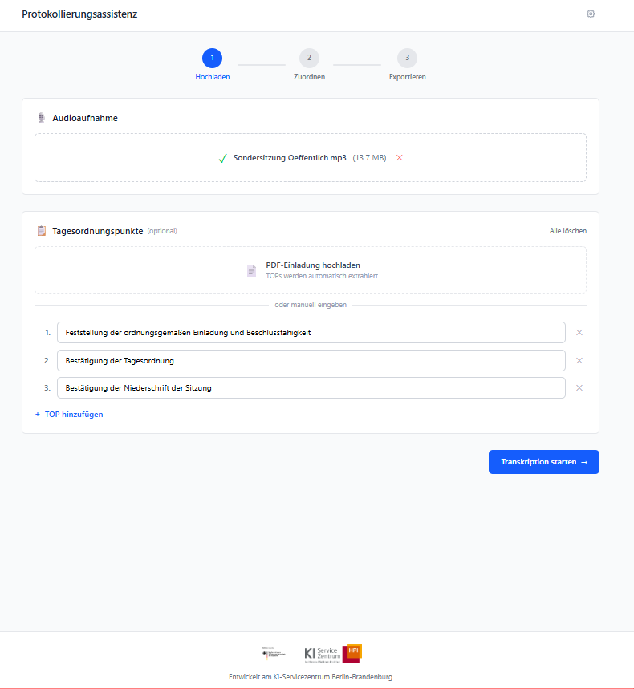
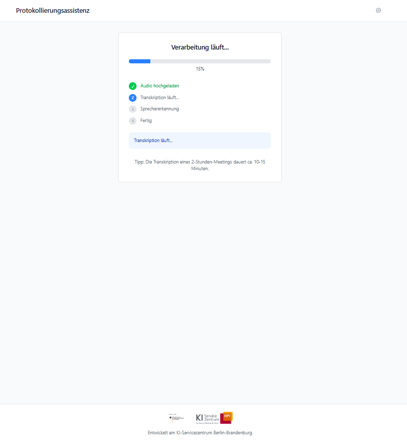
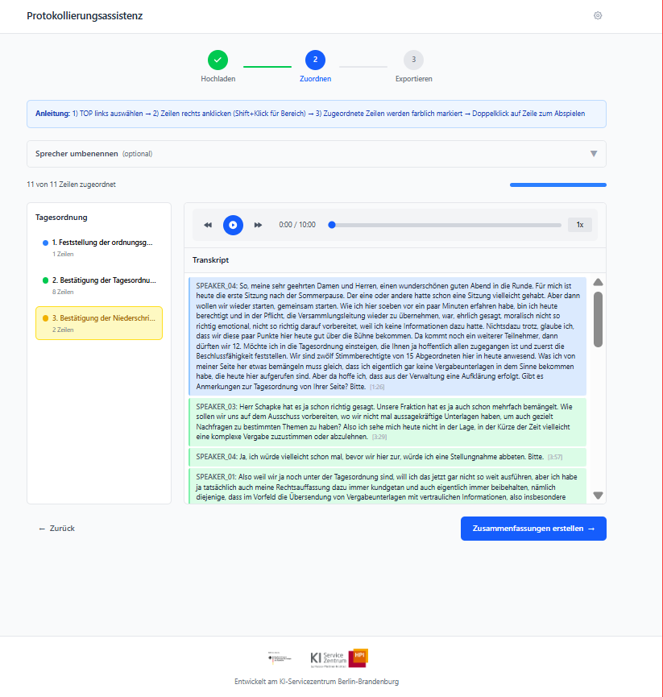
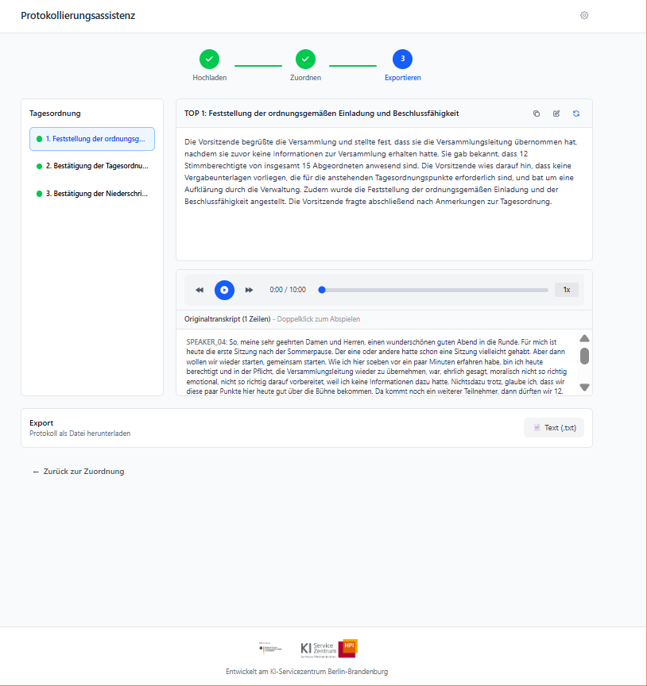

<div style="background-color: #ffffff; color: #000000; padding: 10px;">

<h1> Automatic Protocols — committee transcripts → protocols
</div>

Fine-tune and run a LoRA adapter on `google/gemma-4` to turn Landtag/committee meeting
**transcripts** into structured German **protocols** (per agenda item / *Tagesordnungspunkt*).
The pipeline ingests raw audio/PDF/DOCX, prepares speaker-labelled and TOP-tagged transcripts,
builds an instruction dataset, trains a (Q)LoRA adapter, and generates protocol summaries.

The default base is **`google/gemma-4-E2B-it`** (small, ungated — for implementation and
testing); scale up with `BASE_MODEL=google/gemma-4-31B-it`. Training is **QLoRA (4-bit)** or
bf16 LoRA on a single 80 GB H100. Approx VRAM for the 31B (seq 4096, batch 1, gradient
checkpointing, AdamW-8bit, LoRA r=16): **QLoRA 4-bit ≈ 24–28 GB**; **16-bit LoRA ≈ 68–72 GB**
(fits one H100 tightly). Full fine-tuning would need ~500 GB.

## Example

The fine-tuned adapter turns a prepared transcript into a structured protocol per agenda item.
The screenshots below are placeholders from the sister project
[`pilotproject-protokollierungsassistenz`](https://github.com/aihpi/pilotproject-protokollierungsassistenz)
(the interactive app around the same task) and will be replaced with project-specific visuals.

<!-- TODO: placeholder screenshots from the sister app — replace with project-specific visuals -->
<table>
  <tr>
    <td></td>
    <td></td>
  </tr>
  <tr>
    <td></td>
    <td></td>
  </tr>
</table>

## Pipeline

| stage | script | what it does |
|---|---|---|
| **A. Ingest** | `scripts/import_dropzip.py`, `ingest_corpus.py`, `pdf_to_markdown.py`, `docx_to_markdown.py`, `transcribe.py` | reshape new flat data drops into the corpus, stage it (incrementally), PDF/DOCX/audio → markdown |
| **B. Prepare** | `tag_transcript_tops.py`, `match_speakers.py` | tag agenda-item (TOP) boundaries and resolve speaker names → `data/transcripts/md_prepared/` |
| **C. Dataset** | `scripts/build_dataset.py` | pair transcripts↔protocols per TOP, write chat-format `train/val.jsonl` |
| **D. Train** | `scripts/train_lora_unsloth.py` (+ `train_lora_unsloth.sbatch`) | canonical Unsloth (Q)LoRA fine-tune on SLURM, single H100; alternative stacks (PEFT/FSDP/Keras/Axolotl) live in `alternative_frameworks/` |
| **E. Infer** | `scripts/infer_summary.py` (+ `infer_summary.sbatch`) | generate protocol summaries from new transcripts |

Shared helper modules used across the stages live in `scripts/utils/` (`prompt_io`,
`model_utils`, `llm_utils`, `speaker_utils`, `eval_io`, `alt_utils`).

> **Dataset-creation vs. dataset-use.** Stages **A–C** (`import_dropzip.py`, `ingest_corpus.py`,
> `pdf_to_markdown.py`, `docx_to_markdown.py`, `transcribe.py`, `tag_transcript_tops.py`,
> `match_speakers.py`, `build_dataset.py`) exist **only to (re)build the training dataset from the raw
> audio/PDF corpus**. If you already have the prepared dataset (`data/train/cap65k/`, the committed
> deliverable), you do **not** run any of them — you only need stage **D** (`train_lora_unsloth.py`)
> and stage **E** (`infer_summary.py` / `eval_lora.py`). Re-run A–C only to ingest a new data drop or
> change the dataset.

## Repository structure

```
.
├── scripts/                  the pipeline: data prep, training, eval, inference
│   └── utils/                shared helpers (prompt/model/llm/speaker/eval/alt)
│       └── prompt_summarize.txt   summarisation system prompt (single source of truth)
├── alternative_frameworks/   parked non-canonical LoRA trainers (PEFT/FSDP/Keras/Axolotl) + README
├── 00_aisc/img/              logos / branding
├── data/                     gitignored working dir (corpus, intermediates, dataset)
├── results/                  trained adapters (results/YYYYMMDD-HHMMSS/)
├── pyproject.toml            base deps; alt-framework extras are a dependency record only
├── CHANGELOG.md
└── README.md
```

## Quick start

```bash
uv sync                                            # install the base environment once

# Train (SLURM) — canonical Unsloth (Q)LoRA on the 31B, single H100
BASE_MODEL=google/gemma-4-31B-it MAX_SEQ_LEN=65536 \
  TRAIN_JSONL=data/train/cap65k/train.jsonl VAL_JSONL=data/train/cap65k/val.jsonl \
  sbatch scripts/train_lora_unsloth.sbatch

# Infer with a trained adapter
INPUT=data/transcripts/md_prepared/example_Transkript.md \
  ADAPTER=results/<YYYYMMDD-HHMMSS> sbatch scripts/infer_summary.sbatch
```

Each training run writes a self-contained `results/YYYYMMDD-HHMMSS/` folder (adapter + tokenizer
+ `train_log.md` + `README.md`). The full stage-by-stage runbook is below.

## Setup

### Secrets (`.env`)

`cp .env_example .env` and fill in:
- `HF_TOKEN` — HuggingFace token (gated models, download rate limits; required for the diarisation model in transcription and for gated base models).
- `OPENAI_API_KEY` + `OPENAI_API_BASE` — the self-hosted gpt-oss endpoint used by stage **B** (TOP detection + speaker resolution). Example base: `https://api.aisc.hpi.de/`.

The SLURM launchers and the stage-B scripts source `.env` automatically. `.env` is gitignored; never commit it.

### Running on SLURM (cluster specifics)

> The `.sbatch` scripts are written for the **HPI cluster** and require SLURM. Values such as
> `--account`, `--qos`, `--partition`, `--constraint` and module/HF paths must be adjusted for a
> different cluster (they are marked inline in the scripts).

The GPU sbatch scripts (`transcribe*.sbatch`, `train_lora_unsloth.sbatch`) already set
`--account=aisc --partition=aisc-batch`. CPU-only work (e.g. the optional
`pdf_to_markdown.sbatch`) runs under the **`default` account + `normal` QOS** on `cpu-batch`
(the `aisc` account/QOS is GPU-partitions only); those scripts set that themselves. `HF_HOME`
defaults to shared project storage so large model downloads stay off the home quota. `uv sync`
once to install.

## Running the pipeline

All paths below assume the corpus lives under **`data/`** (gitignored, a real working dir). The
raw delivery is read-only shared storage, symlinked in as **`data/raw`**; stage **A0** stages it
into the flat layout the rest of the pipeline expects. Stages run in order; each writes a new
sub-folder so you can inspect intermediates.

```
data/raw/                                read-only symlink → shared corpus (nested Committee/[WP/]Session/)
data/protocols/pdf/      <stem>_Protokoll.pdf   A0 → symlinks to raw protocol PDFs (input)
data/transcripts/audio/  <stem>_Transkript.mp3  A0 → symlinks to raw session MP3s (input)
data/transcripts/manifest.txt            A0 → staged audio paths of trainable sessions (full corpus)
data/transcripts/manifest_new.txt        A0 → delta manifest: only NEW/CHANGED sessions (incremental runs)
data/ingest_report.tsv                   A0 → per-session stem/flags/state audit
data/ingest_ledger.json                  A0 → persistent record of what has been ingested (incremental tracking)
data/import_report.tsv                   A0 → import_dropzip.py audit for a new flat drop
data/protocols/md/                       A → markdown protocols  ← protocol source (cleaned internally at build)
data/protocols/md_clean/   (+ cover/)    A → OPTIONAL inspection output of preprocess_protocol.py (not a build input)
data/transcripts/md/                     A → diarised transcripts (<SD-SPK>SPEAKER_NN, timestamps)
data/transcripts/md_top/   (+ top_reports/)   B → transcripts with <SD-TOP> agenda tags
data/transcripts/md_prepared/            B → speaker labels replaced with real names  ← dataset source
data/speaker_maps/                       B → per-session resolution reports
data/exclusions/                         B → exclusions folder; all exclusions_*.json (TOPs to drop, unresolved speakers) live here
data/train/<name>/{train,val}.jsonl      C → each generated dataset in its own subfolder (e.g. data/train/cap65k, the committed deliverable)
results/lora_adapter/                    D → trained adapter
results/summaries/                       E → generated protocols
```

### A0. Ingest the raw corpus (stage the nested delivery → flat layout)

The delivered corpus is nested `Committee/[Wahlperiode/]Session/` folders, each with a protocol
**PDF** + a session **MP3** and inconsistent file names. Point `data/raw` at it once:

```bash
ln -s /sc/projects/sci-aisc/pilotproject-automatic-protocols/data/raw data/raw
```

`ingest_corpus.py` walks `data/raw`, derives a canonical session stem `<ABBR>[_<WP>]_<NN>`
(committee abbreviation from the top folder's parens, optional Wahlperiode, sitting number) and
creates **relative symlinks** into the flat layout — `data/protocols/pdf/<stem>_Protokoll.pdf`
and `data/transcripts/audio/<stem>_Transkript.mp3` — plus `data/transcripts/manifest.txt` (audio
of the trainable sessions, i.e. those with both a PDF and audio) and `data/ingest_report.tsv`
(per-session audit with flags `MISSING_PDF` / `MISSING_AUDIO` / `MULTIPART(n)` /
`COLLISION_WITH:…`).

```bash
uv run python scripts/ingest_corpus.py            # --dry-run to preview, --overwrite to re-link
```

Inspect `data/ingest_report.tsv` before converting — flagged rows are skipped from the manifest.
Multi-part audio (e.g. `SLausitz_3`) is staged as `<stem>_Transkript.pt01.mp3`, `.pt02.mp3`, …;
after transcription, merge the parts back into one transcript:

```bash
uv run python scripts/ingest_corpus.py --merge-parts --transcript-dir data/transcripts/md
```

#### Adding a new data drop (`import_dropzip.py`)

New deliveries often arrive as a **flat** folder (e.g. an unzipped `Daten/`) named
`<sitting>. <ABBR> {vom|am} <DD.MM.YYYY>[ Teil N][ (2)].{mp3,pdf}`, not the nested
`Committee/[WP/]Session/` layout. `scripts/import_dropzip.py` reshapes it into the corpus so
`ingest_corpus.py` can stage it unchanged. Stems become `<ABBR>_<WP>_<NN>`.

```bash
# unzip the drop somewhere, then preview the planned placement (writes nothing):
uv run python scripts/import_dropzip.py import --drop-dir /path/to/Daten --dry-run

# committee folders may be root-owned (no sudo): adopt them once (moves the original to a
# data2_archive/ sibling, copies it back user-owned), then import for real:
uv run python scripts/import_dropzip.py adopt  --committees "A 11 (AHF)" "A 6 (AWFK)"
uv run python scripts/import_dropzip.py import --drop-dir /path/to/Daten   # --wp N (default 7)
```

Multipart audio (`… Teil 1/2`, or a second `(2)` recording) is placed as ordered parts in one
session folder; an identical duplicate PDF is deduped. Review `data/import_report.tsv`, then run
`ingest_corpus.py`.

#### Incremental ingest (ledger + delta manifest)

`ingest_corpus.py` keeps a persistent **ledger** (`data/ingest_ledger.json`) keyed by stem with a
size+mtime signature of each session's sources. Every run classifies sessions as
**NEW / UNCHANGED / CHANGED / MISSING** (shown in the `state` column of `ingest_report.tsv`) and
writes a **delta manifest** `data/transcripts/manifest_new.txt` listing only the NEW/CHANGED
trainable sessions, so transcription and the LLM prepare-stages can process just the new drop
instead of the whole corpus. The first run (no ledger) marks everything NEW; `--no-ledger`
restores the old behaviour, `--hash` uses sha256 signatures, `--prune-missing` forgets vanished
sessions.

> When bootstrapping the ledger on a corpus whose transcripts already exist, transcribe the genuine
> delta by listing the manifest entries whose `data/transcripts/md/<stem>_Transkript.md` is missing
> (the ledger's first-run "all NEW" cannot tell apart pre-existing sessions). Subsequent drops get a
> correct delta straight from `manifest_new.txt`.

### A. Data conversion & cleaning

All converters take `--input` (a file **or** a directory) and `--out-dir`, skip existing outputs
unless `--overwrite`, and use exit codes 0/1/2.

```bash
# 1) protocol PDF → markdown (Docling, layout + table aware; OCR off, born-digital)
uv run python scripts/pdf_to_markdown.py --input data/protocols/pdf --out-dir data/protocols/md
#    Docling is memory-hungry; a full corpus OOM-kills on the login node. For many/large
#    PDFs run it on a compute node instead (idempotent — skips already-converted files):
#    INPUT=data/protocols/pdf OUT_DIR=data/protocols/md sbatch scripts/pdf_to_markdown.sbatch

# 2) OPTIONAL — materialise cleaned protocols for inspection: split off the cover
#    (title/attendance/agenda) into md_clean/cover/, drop the Anlagen section, page-footer
#    tables, <!-- image -->, hyperlinks and attachment footnotes. Verifies the cover boundary
#    per file (OK/WARN/FAIL). build_dataset.py applies the same clean_protocol internally, so
#    this step is not required to build the dataset.
uv run python scripts/preprocess_protocol.py --input data/protocols/md --out-dir data/protocols/md_clean

# 3) transcripts: audio → diarised markdown (Whisper + pyannote) with <SD-SPK>SPEAKER_NN tags
#    and [HH:MM:SS --> HH:MM:SS] segments (NO agenda tags yet). Runs on GPU/SLURM:
INPUT_LIST=data/transcripts/manifest.txt OUT_DIR=data/transcripts/md DIARIZE=1 \
    sbatch scripts/transcribe.sbatch
#    (alternative: pre-existing transcript DOCX → markdown)
# uv run python scripts/docx_to_markdown.py --input data/transcripts/docx --out-dir data/transcripts/md
```

> **Note**: Docling pulls OpenCV; the cluster has no `libGL`, so `pyproject.toml` pins
> `opencv-python-headless` and a `[tool.uv]` override drops the non-headless `opencv-python` on
> Linux. `torchvision`/`torch`/`torchaudio` are pinned to the cu128 index. Just `uv sync`; no
> system libraries needed.

`preprocess_protocol.py` is also importable: `clean_protocol` and `split_cover` are reused by the
stages below, so stages B and C clean protocols on the fly — passing them raw `data/protocols/md`
works too.

### B. Prepare transcripts: agenda tags + real speaker names (LLM)

The diarised transcripts have **no `<SD-TOP>` agenda markers** and only generic `SPEAKER_NN`
labels. Two scripts fix that, both **LLM-by-default** (gpt-oss-120b via `OPENAI_API_BASE`),
processing sessions in parallel. Shared helpers live in `scripts/utils/speaker_utils.py`
(name/cover parsing) and `scripts/utils/llm_utils.py` (client, JSON chat, parallel map). Pass
`--no-llm` to fall back to regex/heuristics (no key needed).

```bash
# B1) tag agenda items: read the cover agenda, locate where the chair takes up each TOP
#     in the transcript, insert <SD-TOP>TOP N</SD>. Writes a per-session recall report.
uv run python scripts/tag_transcript_tops.py \
    --transcript-dir data/transcripts/md --protocol-dir data/protocols/md \
    --out-dir data/transcripts/md_top

# B2) resolve speakers: map each SPEAKER_NN to a real "Name (Rolle)" — committee members
#     from the cover attendance list, ministers/guests from the protocol prose, chair from
#     the cover "Vorsitz:" line, the rest by LLM. Substitutes names into the transcript and
#     writes an exclusions manifest of TOPs that still contain an unidentified speaker.
uv run python scripts/match_speakers.py \
    --transcript-dir data/transcripts/md_top --protocol-dir data/protocols/md \
    --out-transcript-dir data/transcripts/md_prepared \
    --report-dir data/speaker_maps --exclusions-out data/exclusions/exclusions.json
```

`data/transcripts/md_prepared/` are the **final transcripts** (with `<SD-TOP>` tags and full
names; any unresolved speaker stays `SPEAKER_NN`). Useful flags (both scripts): `--concurrency N`
(parallel sessions), `--max-tokens` (completion budget incl. reasoning — raise if you see a
*truncated/empty* warning), `--llm-model`, `--llm-base-url`, `--no-llm`. For `match_speakers.py`:
`--max-unresolved-sentences N` excludes a TOP only if an unidentified speaker exceeds N sentences
(default 2); `--content-threshold`.

> **TOP boundaries (B1):** `tag_transcript_tops.py` also handles two tricky cases.
> Jointly-handled items ("TOP 4 gemeinsam mit TOP 5") may share an anchor instead of being
> mis-placed; and when one turn both *closes* the previous TOP (vote / "ich schließe den
> Tagesordnungspunkt") and *opens* the next, a follow-up LLM call splits the turn at the right
> segment line so the closing/vote stays with the previous TOP (both halves keep the speaker).
> Disable with `--no-boundary-split`.

Inspect `data/speaker_maps/*.json` (per-label name + method + conflicts) and
`data/transcripts/md_top/top_reports/*.json` (cover vs. found TOPs) before building the dataset.

### C. Build the dataset

`build_dataset.py` pairs prepared transcripts to protocols by filename, splits **per agenda item**
(`per-top`, default — shorter sequences, many more examples; `--granularity document` for one
record per session), drops `--exclusions` TOPs, and writes chat-format JSONL. It cleans the
protocol internally, so point `--protocol-dir` at raw `data/protocols/md` (or `md_clean`).

```bash
uv run python scripts/build_dataset.py \
    --transcript-dir data/transcripts/md_prepared --protocol-dir data/protocols/md \
    --exclusions data/exclusions/exclusions.json --granularity per-top --include-untagged-as-document \
    --holdout-manifest test/manifest.tsv --out-dir data/train/cap65k
```

Output `data/train/cap65k/{train,val}.jsonl`, one record per line (the committed dataset; the exact
recipe + provenance is in [`data/DATASETS.md`](data/DATASETS.md)):

```json
{"messages": [{"role": "system",    "content": "Du bist Protokollführer/in eines Ausschusses. Wandle das wörtliche Transkript …"},
              {"role": "user",       "content": "Erstelle eine Zusammenfassung für folgenden Tagesordnungspunkt:\n\nTOP: Gesetzentwurf zur Änderung des Schulgesetzes\n\nTranskript:\nDaniel Keller (SPD): Ich rufe Tagesordnungspunkt 2 auf …\nKristy Augustin (CDU): Wir lehnen den Entwurf ab …\n\nZusammenfassung:"},
              {"role": "assistant",  "content": "## Zu TOP 2:\n\nDer Hauptausschuss beschließt einstimmig (9 : 0 : 0) …"}],
 "meta": {"stem": "ha_1_", "top": 2, "strategy": "per-top", "src_tokens": 1308, "tgt_tokens": 255, "seq_tokens": 1620}}
```

The model input is built by `scripts/utils/prompt_io.py` — the single source of truth shared by
training, evaluation, inference and the deployment app. It strips the source `<SD-TOP>`/`<SD-SPK>`
tags and `[HH:MM:SS]` timestamps down to clean `Name: utterance` lines (consecutive same-speaker
turns merged) and wraps them in the `TOP: … / Transkript: … / Zusammenfassung:` framing shown
above; the assistant target starts with the `## Zu TOP N:` heading.

The train/val split is **by session** (a session's items never straddle the split). The pairing
log, exclusion count and a token-length summary print to stderr — eyeball them before training.
Override the system prompt with `--system-prompt-file`; change the record schema in `make_record`
if you need TRL's prompt/completion or plain-text formats instead of `messages`.

### D. Train the adapter (GPU / SLURM)

```bash
TRAIN_JSONL=data/train/cap65k/train.jsonl sbatch scripts/train_lora_unsloth.sbatch
```

| Variable      | Default                              |
|---------------|--------------------------------------|
| `TRAIN_JSONL` | (required)                           |
| `VAL_JSONL`   | `data/train/cap65k/val.jsonl` (if present)  |
| `OUT_DIR`     | auto `results/YYYYMMDD-HHMMSS` (4-bit smoke → `results/smoke_lora`) |
| `BASE_MODEL`  | `google/gemma-4-E2B-it`              |
| `MAX_SEQ_LEN` | auto = model context window (empty)  |
| `BITS`        | `16` (bf16 LoRA; `4` = QLoRA smoke)  |
| `EPOCHS`      | `3`                                  |
| `MAX_STEPS`   | `-1` (use epochs; set small to smoke-test) |
| `LR`          | (empty = `2e-4`)                     |

The sbatch also sets `#SBATCH --qos=aisc` (faster AISC queueing),
`PYTORCH_CUDA_ALLOC_CONF=expandable_segments:True` (allocator fragmentation), and
`PYTHONUNBUFFERED=1` (stream the per-step loss to the `.out` log). Each run writes a
`train_log.md` **and** a `README.md` of its settings into the timestamped output dir.

Scale up to the 31B with `BASE_MODEL=google/gemma-4-31B-it`. `HF_HOME` defaults to shared project
storage to keep downloads off the home quota.

The canonical Unsloth trainer (`scripts/train_lora_unsloth.py`) takes
`--lora-r/--lora-alpha/--lora-dropout`, `--epochs`, `--max-steps`, `--lr`,
`--batch-size`/`--grad-accum`, `--max-seq-len`, `--early-stopping-patience`. Flags specific to the
alternative trainers (`--bits`, `--cce`, `--packing`, `--attn`, `--target-modules`/
`--exclude-modules`) are documented in
[`alternative_frameworks/README.md`](alternative_frameworks/README.md).

> **Watch the sequence length:** per-TOP records with timestamps can exceed `MAX_SEQ_LEN=4096`
> real tokens and get truncated (losing part of the target). Raise `--max-seq-len` (e.g. 8192)
> for long sessions.

### E. Inference (GPU / SLURM)

```bash
INPUT="data/transcripts/md_prepared/example_Transkript.md" \
    ADAPTER=results/lora_adapter sbatch scripts/infer_summary.sbatch
```

`infer_summary.py` loads the base model (4-bit) + adapter, and with `--granularity per-top`
(default) summarises each numbered `<SD-TOP>` segment and concatenates them under `Zu TOP N`
headings. Feed it prepared transcripts (the `data/transcripts/md_prepared/` files carrying the
`<SD-TOP>`/`<SD-SPK>` tags); it renders them through the same `prompt_io` contract as training
(tags + timestamps stripped to clean `Name: utterance` lines). Tune with `--temperature`, `--top-p`,
`--max-new-tokens`; `--stream` echoes tokens to stderr.

> **Unsloth adapters:** an adapter trained by the canonical Unsloth trainer only loads through
> Unsloth (`Gemma4ClippableLinear`), so run inference with `scripts/infer_unsloth.py` rather than
> stock PEFT. Stock-PEFT/FSDP adapters load with `infer_summary.py`.

### F. flash-attn note

Training defaults to **`sdpa`**, which needs no extra build, so flash-attn is optional and
intentionally **not** in `pyproject.toml`. If you want it (a bit faster / less memory at long
sequence lengths), install it once and pass `--attn flash_attention_2` (alternative trainers):

```bash
uv pip install flash-attn --no-build-isolation
```

## Long-context training

gemma-4-31B has a ~262k-token vocabulary, so the standard loss materialises a `seq_len × vocab`
logits tensor that OOMs a single 80 GB H100 beyond ~32k tokens. The **canonical Unsloth trainer**
sidesteps this with its fused cross-entropy and offload, training the 31B at **32768+** on a
single H100 (**65536** is the practical max reached). The multi-GPU FSDP route reaches the same
caps with **cut-cross-entropy** (`alternative_frameworks/gemma4_cce_patch.py`). Uncapped
162k-token records still OOM on every stack (attention/activation memory, not logits, and
gemma-4's `head_dim>256` blocks FlashAttention) — true 162k needs sequence/context parallelism.
Full comparison and open problems: [`alternative_frameworks/README.md`](alternative_frameworks/README.md).

## Limitations

- Built for German committee/Landtag protocols; the TOP-tagging heuristics are committee-oriented.
- Very long whole-document records (100k+ tokens) stress attention/activation memory; cap or shard as needed.

## Alternative training frameworks

Unsloth is the canonical trainer; framework-diverse experiments (PEFT, FSDP/ZeRO-3, Keras/JAX,
Axolotl) built to beat the long-context OOM are parked under `alternative_frameworks/`. See
[`alternative_frameworks/README.md`](alternative_frameworks/README.md) for the comparison,
per-framework status and run instructions.

## References

- [AI Service Centre Berlin-Brandenburg](https://hpi.de/kisz)

## Contact

Questions and installation support: [kisz@hpi.de](mailto:kisz@hpi.de).

## Authors

- [Hanno Müller](https://github.com/hanno-mueller-hpi)

## License

This project is licensed under the MIT license — see [LICENSE](LICENSE).

---

## Acknowledgements


The [AI Service Centre Berlin Brandenburg](http://hpi.de/kisz) is funded by the [Federal Ministry of Research, Technology and Space](https://www.bmbf.de/) under the funding code 16IS22092.
