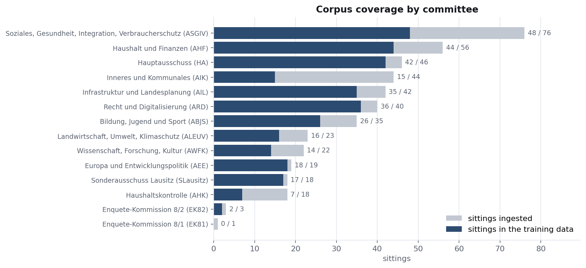
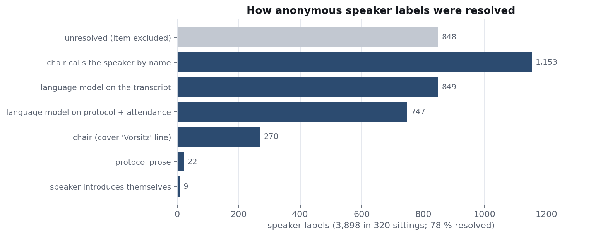
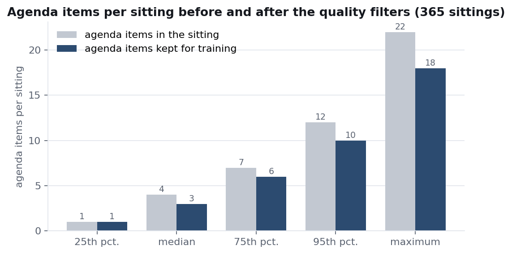
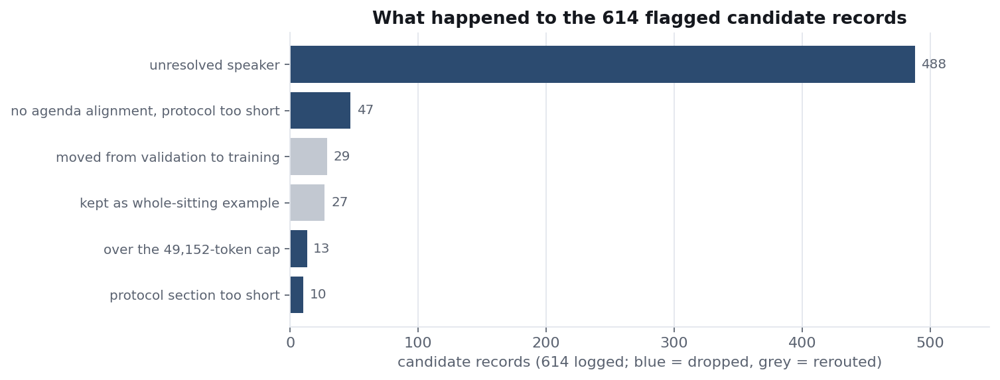
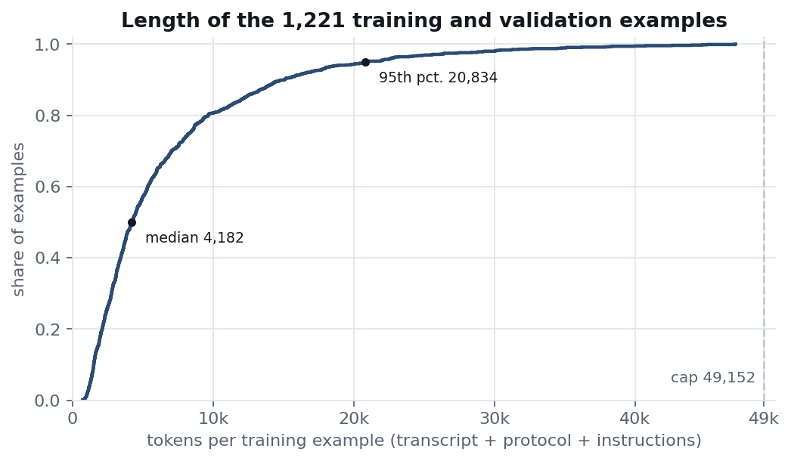
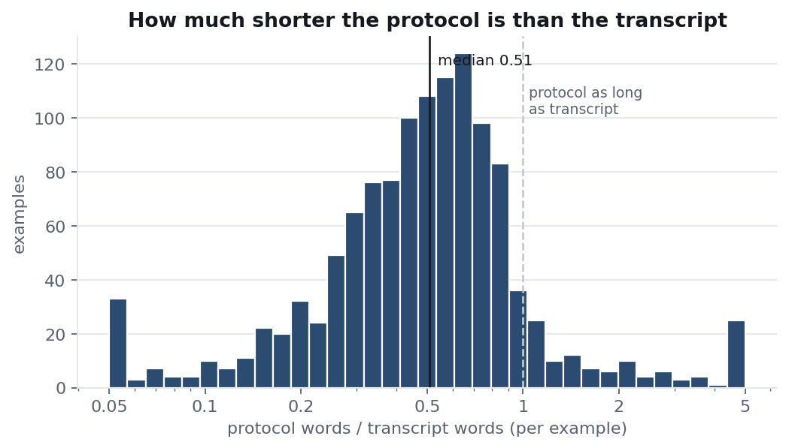

# Training data and training process of the protocol model

*AI Service Centre Berlin-Brandenburg (KISZ), Hasso Plattner Institute. Report dated 4 September 2026.*

This report describes the data and the procedure behind the language model that produces the "Landtagstil" drafts in the Protokollierungsassistenz. It covers what the model was trained on, how that material was prepared and filtered, how long the inputs are, and how the training itself was configured. Usage guidance and evaluation results are documented separately.

## 1. Summary

The model is a LoRA adapter for Google's `gemma-4-31B-it`, a 31-billion-parameter instruction-tuned language model. The adapter was trained on 1,115 examples drawn from 320 committee sittings of the Landtag Brandenburg. Each example pairs the automatic transcript of one agenda item (Tagesordnungspunkt, TOP) with the section of the official protocol that records that item. The model learns to write the protocol section from the transcript.

| | |
|---|---|
| Base model | `google/gemma-4-31B-it`, loaded in 4-bit precision (QLoRA) |
| Adapter | LoRA, rank 8, all linear projection layers |
| Training examples | 1,115 (validation: 106) from 320 sittings |
| Longest example | 47,138 tokens; cap 49,152 |
| Training | 3 passes over the data, one H100 GPU, 19.5 hours |
| Validation loss | 0.6927 |

## 2. The corpus

The Landtag Brandenburg provided audio recordings and the published protocols of committee sittings from November 2019 to April 2026. 443 sittings across 14 committees were ingested. Not every sitting can be used: some have no recording or no protocol, some protocols could not be aligned with the recording, and many agenda items were removed by the quality filters described in section 4. In the end 320 sittings contribute at least one training example.

| committee | sittings ingested | sittings in the training data |
|---|---|---|
| Ausschuss für Soziales, Gesundheit, Integration und Verbraucherschutz (ASGIV) | 76 | 48 |
| Ausschuss für Haushalt und Finanzen (AHF) | 56 | 44 |
| Hauptausschuss (HA) | 46 | 42 |
| Ausschuss für Inneres und Kommunales (AIK) | 44 | 15 |
| Ausschuss für Infrastruktur und Landesplanung (AIL) | 42 | 35 |
| Ausschuss für Recht und Digitalisierung (ARD) | 40 | 36 |
| Ausschuss für Bildung, Jugend und Sport (ABJS) | 35 | 26 |
| Ausschuss für Landwirtschaft, Umwelt und Klimaschutz (ALEUV) | 23 | 16 |
| Ausschuss für Wissenschaft, Forschung und Kultur (AWFK) | 22 | 14 |
| Ausschuss für Europa und Entwicklungspolitik (AEE) | 19 | 18 |
| Ausschuss für Haushaltskontrolle (AHK) | 18 | 7 |
| Sonderausschuss Lausitz (SLausitz) | 18 | 17 |
| Enquete-Kommission 8/2 (EK82) | 3 | 2 |
| Enquete-Kommission 8/1 (EK81) | 1 | 0 |

The published protocols are the training targets. They were written by the committee secretariats and follow the house conventions: decisions and vote results first ("Beschlüsse und Festlegungen"), then the course of the debate ("Aus der Beratung") in indirect speech. The model therefore learns this register; it does not invent it.

## 3. From recording to training example

Each sitting passes through five preparation steps before it becomes training material.

**Transcription.** The recording is transcribed with WhisperX (Whisper large-v3) and segmented by speaker with pyannote. The result is a time-stamped transcript in which each speaker is an anonymous label such as `SPEAKER_07`.

**Protocol conversion.** The protocol PDF is converted to text with Docling. The cover page (attendance list and agenda) is separated from the body; attachments, page footers and hyperlinks are removed.

**Agenda tagging.** A large language model (gpt-oss-120b, hosted at HPI) reads the agenda from the protocol cover and locates the point in the transcript where the chair takes up each item. The transcript is split at those points, one segment per TOP.

**Speaker resolution.** The same model, combined with rule-based matching against the attendance list and the protocol text, replaces each anonymous speaker label with a name and role wherever that is possible with confidence. Of 3,898 speaker labels in the 320 sittings, 3,050 (78 %) were resolved. The most frequent evidence is the chair addressing the next speaker by name; the second largest source is the transcript itself, where a speaker introduces themselves or is named in a later turn.

**Pairing.** The transcript segment of each TOP is paired with the protocol section that carries the same TOP number. The pair becomes one training example: the system prompt (the instructions the model also receives in the app), the transcript segment as the user message, and the protocol section as the expected answer. Sittings whose TOP structure could not be aligned are kept as a single whole-sitting example where the protocol is long enough (18 such examples).

## 4. Quality filters

Not every agenda item becomes a training example. The build logged 614 candidate records as needing a decision; 558 of them were dropped and the rest were rerouted.

| reason | records | what it means |
|---|---|---|
| Unresolved speaker | 488 | the TOP contains a speaker whose name could not be established; the model must never learn to guess a name |
| No aligned TOPs, protocol too short | 47 | the sitting could not be split by agenda item and the whole protocol is too short to serve as a target |
| Over the length cap | 13 | transcript plus protocol exceed 49,152 tokens |
| Target too short | 10 | the protocol section has fewer than 32 tokens |
| Moved from validation to training | 29 | longer than the 8,192-token budget for validation examples (rerouted, not dropped) |
| Kept as whole-sitting example | 27 | no agenda alignment, but the protocol is long enough (rerouted, not dropped) |

The unresolved-speaker rule is the largest filter by far and is deliberate. A protocol attributes every statement to a named person. If the training data contained turns by `SPEAKER_07` next to a protocol that names the speaker, the model would learn that inventing a name is acceptable. Dropping those items costs data: of 365 sittings that reached the filter stage, 223 (61 %) lost at least one agenda item.

## 5. How long the inputs are

Lengths are given in tokens, the units the model reads. Measured with the model's own tokenizer on this corpus, one German word costs 1.60 tokens in spoken transcript and 1.88 tokens in written protocol prose. A budget of 32,768 tokens therefore holds roughly 20,500 words of transcript or 17,400 words of protocol, and about 19,000 words end to end including the instructions.

| | median | 95th percentile | 99th percentile | maximum |
|---|---|---|---|---|
| tokens per example (transcript + protocol + instructions) | 4,182 | 20,834 | 35,066 | 47,138 |
| tokens per sitting (all examples of the sitting) | 16,898 | 71,848 | 93,402 | 119,567 |
| words in the transcript segment | 1,416 | 8,644 | 15,120 | 28,326 |
| words in the protocol section | 659 | 3,781 | 8,408 | 18,665 |

Half of all examples are under 4,200 tokens; one in twenty is longer than 20,000. The protocol section is typically about half as long as the transcript it summarises (median ratio 0.51, interquartile range 0.32 to 0.72), although one in twenty protocol sections is longer than its transcript, usually because the protocol records the wording of motions and decisions in full.

## 6. The sequence cap

Training a model on long inputs is limited by GPU memory. The last step of the loss computation materialises a table of one row per token and one column per vocabulary entry; gemma-4 has 262,144 vocabulary entries, so this table alone takes about 0.5 MB per token and grows linearly with the length of the longest example. To keep the run on a single 80 GB GPU a cap on the example length is needed, and examples above the cap are excluded from training.

Four otherwise identical runs were trained with different caps to see how much the cap matters:

| cap (tokens) | training examples | longest example | validation loss |
|---|---|---|---|
| 32,768 | 1,100 | 32,697 | 0.6936 |
| 40,960 | 1,110 | 40,745 | 0.6942 |
| **49,152** | **1,115** | **47,138** | **0.6927** |
| 65,536 | 1,122 | 64,970 | out of memory at step 96 |

The three completed runs lie within 0.0015 of each other: above 32k tokens the cap decides whether the run fits into memory, not how good the model is. The cap of 49,152 was chosen because it admits the most examples while still completing on one GPU. The 65k run failed when it met a record of roughly 56,000 tokens, whose logits table alone needed 27 GB.

## 7. Training configuration

| | |
|---|---|
| Method | QLoRA: the base model is frozen in 4-bit precision, only the low-rank adapter is trained |
| Adapter | rank 8, scaling factor 8, no dropout, on all attention and feed-forward projections |
| Loss | computed on the protocol section only, not on the instructions or the transcript |
| Optimiser | AdamW (8-bit), learning rate 2e-4 with linear decay, 5 warm-up steps, weight decay 0.001 |
| Batch | 1 example per step, gradients accumulated over 4 steps |
| Schedule | 3 passes over the training data, evaluation after each pass, best checkpoint kept, stop early if validation loss does not improve for 3 evaluations |
| Hardware | one NVIDIA H100 80 GB on the HPI cluster, 19.5 hours |
| Software | Unsloth (fused attention and loss kernels), TRL, PEFT |
| Result | training loss 0.2054, validation loss 0.6927 |

For context: the previous model in the app, trained in June 2026 on 229 examples from 68 sittings with a rank-32 adapter, reached a validation loss of 0.7369. The new model differs from it in corpus size, speaker resolution, adapter rank, epoch count and cap at once, so the improvement cannot be attributed to any single change.

## 8. Known limitation of the training data

The protocol PDFs are typeset with justified text. Their conversion to plain text left runs of several spaces inside lines in 92 % of the training targets, and about 130 words split at former line breaks ("inner- halb"). The model has learnt to reproduce the double spaces occasionally. The conversion step has since been corrected and the dataset rebuilt; the model in the app predates that fix and will be retrained on the corrected data. Genuine spelling errors in the official protocols are rare, roughly one per 65,000 words, and were left as they are.

## 9. Reproducibility

The full pipeline, the training and evaluation scripts, the exact dataset recipe and the run logs are published in the repository `aihpi/pilotproject-automatic-protocols`. The corpus itself, the derived datasets and the adapter weights are not part of the repository, since the recordings and protocols are not redistributable; the adapter is served to the app from HPI's model hub.
